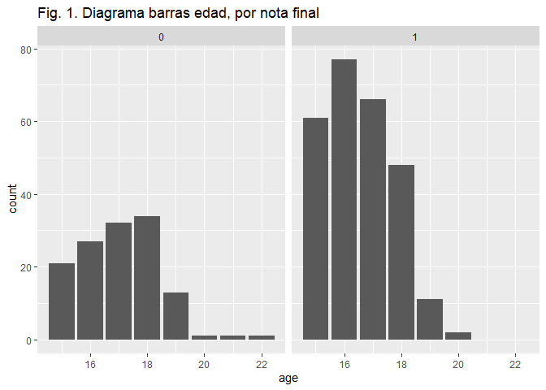
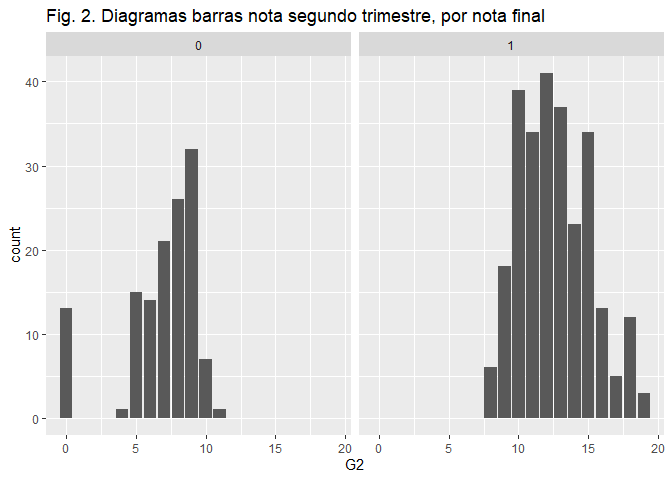
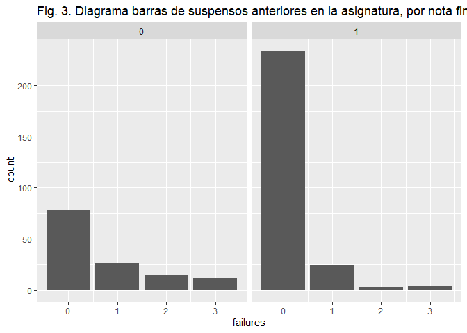
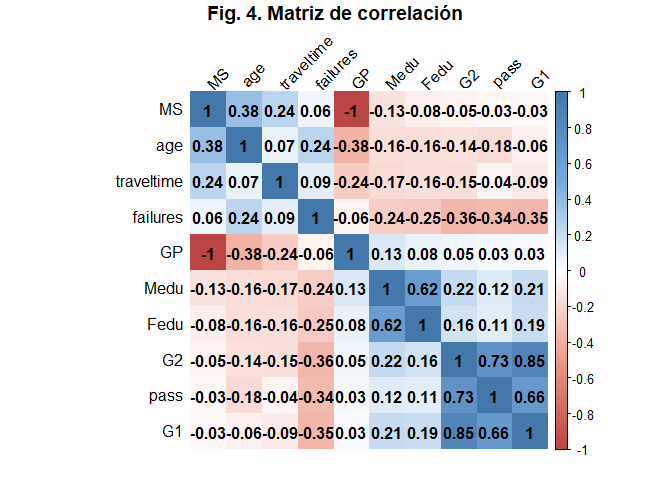
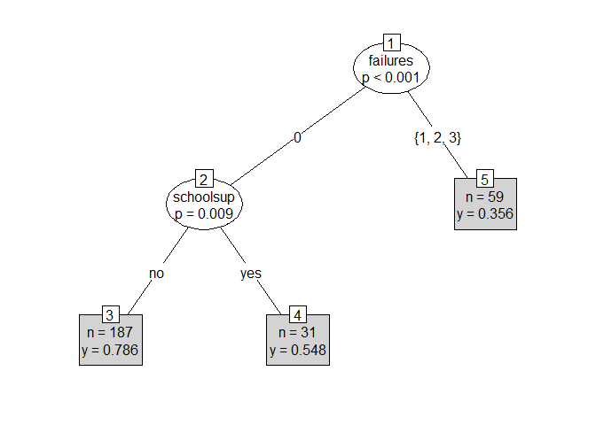
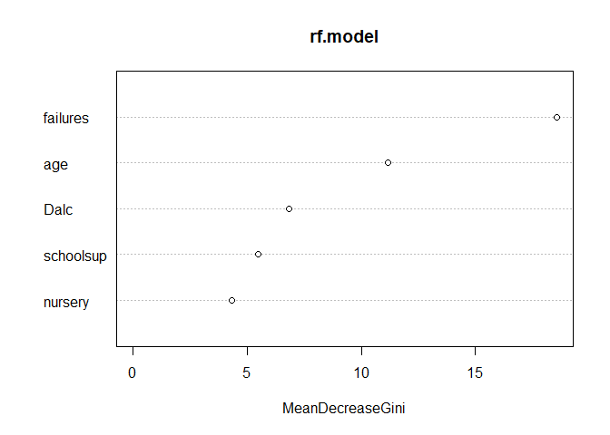

Informe
================
Ricardo Roldán
22/11/2020

## Análisis y elaboración de un modelo Machine Learning para predecir el aprobado o no de un alumno

En el presente informe, se va a describir cómo se ha realizado un
análisis exploratorio y se han elaborado dos modelos Machine Learning a
partir de un dataset que contiene las diferentes notas obtenidas por los
alumnos en la asignatura de matemáticas en dos colegios portugueses,
además de otras variables relacionadas con el contexto de cada alumno.
El objetivo de esta tarea no es más que establecer un modelo que nos
permita predecir si un alumno va a aprobar o no (varíable *pass*),
dándole como entrada al modelo los diferentes datos de éste.

## Carga de datos y análisis descriptivo

En esta primera parte del informe, se va a explicar cómo se han cargado
los datos y sobre todo, cómo se ha realizado el análisis exploratorio
inicial del dataset. De esta forma, podremos comenzar a tener una
perspectiva general del problema a realizar y cómo encararlo. Empezamos
cargando los datos y las librerías que van a ser necesarias durante el
proceso. También, a través de la función *summary*, observamos las
diferentes variables para tener una idea general de ellas y sus valores
estadísticos fundamentales, aunque no se incluye en el informe por
ahorro de espacio.

``` r
studentMat=read.table("./datos/student-mat.csv", row.names=NULL, sep=";", header=TRUE)
library(knitr)
library(xtable)
library(ggplot2)
library(corrplot)
library(grid)
library(gridExtra)
library(arules)
library(arulesViz)
library(mlbench)
library(caret)
library(ROCR)
library(dplyr)
library(corrplot)
library(e1071)
library(party)
library(randomForest)
```

Siendo nuestro objetivo el ser capaces de predecir con precisión el
aprobado o no del alumnado, parece razonable empezar a estudiar el
comportamiento de algunas variables que pueden tener un impacto directo
en las notas, como lo son las variables *studytime*, *age*, y *goout*.
Se obtuvieron en primer lugar varios histogramas con estas variables,
pero éstos no eran muy concluyentes, por lo que a continuación, vamos a
ver con más detalle cómo influyen otras tres variables (mantenemos *age*
y analizamos *G2* y *failures*) en la nota del alumno. Hemos probado con
anterioridad a ver la relación entre estas tres variables y la nota
“G3”, pero no era muy cómodo de visualizar y sacar conclusiones
debido a las 20 divisiones reflejadas. Por tanto, vamos a crear ya la
variable binaria *pass* (1=Aprobado, 0=Suspenso) que nos facilitará a
estudiar mejor esta relación y que usaremos como variable target.

``` r
#Creamos la variable binaria *pass*, en la que si la nota es mayor que 9 se le asignará el valor 1, y viceversa.
studentMat$pass <- ifelse(studentMat$G3>9, 1, 0)
#Representamos los distintos diagramas separándolos en aprobados (1) y suspensos (0).
ggplot(studentMat, aes(age)) + geom_bar() + facet_wrap(~ pass) + ggtitle ("Fig. 1. Diagrama barras edad, por nota final")
```

<!-- -->

``` r
ggplot(studentMat, aes(G2)) + geom_bar() + facet_wrap(~ pass) + ggtitle ("Fig. 2. Diagramas barras nota segundo trimestre, por nota final")
```

<!-- -->

``` r
ggplot(studentMat, aes(failures)) + geom_bar() + facet_wrap(~ pass) + ggtitle ("Fig. 3. Diagrama barras de suspensos anteriores en la asignatura, por nota final")
```

<!-- -->

Después de la representación, se observan dos comportamientos diferentes
según la edad de la persona. Se podría partir de la premisa que quizás,
los alumnos de 18 o más años son repetidores de curso que han mantenido
esta tendencia en el año escolar analizado.También presentan
distribuciones diferentes las variables *failures* y, como era de
esperar, las notas del segundo trimestre *G2*. Parece lógico pensar que
el haber suspendido la asignatura en cursos anteriores, afecta al
rendimiento del alumno, al igual que la nota del segundo trimestre, que
salvo sorpresa, no debe varíar mucho respecto a la nota final *G3*, o su
suspenso o aprobado. También puede ser interesante para obtener un
panorama general de cómo de correladas están las variables entre sí
generar una matriz de correlación. Creamos dos variables dummies para
las variables de tipo factores que vayamos a incluir en la matriz de
correlación y representamos ésta. Las variables seleccionadas son las
que a nuestro juicio, después de probar con el resto de variables, son
las que más información nos van a aportar en este informe.

``` r
#Creamos las variables dummies
studentMat$GP = ifelse(studentMat$school == "GP", 1, 0) 
studentMat$MS = ifelse(studentMat$school == "MS", 1, 0)
#Generamos la matriz de correlación
matCor=cor(studentMat[,c("GP","MS","Medu","Fedu","age","G1","G2","pass","traveltime","failures")])
col <- colorRampPalette(c("#BB4444", "#EE9988", "#FFFFFF", "#77AADD", "#4477AA"))
corrplot(matCor, method = "shade", shade.col = NA, tl.col = "black", tl.srt = 45, col = col(200), addCoef.col="black", order="AOE", mar = c(1,0,2,0), line=1, is.corr=FALSE, main = "Fig. 4. Matriz de correlación")
```

    ## Warning in text.default(pos.xlabel[, 1], pos.xlabel[, 2], newcolnames, srt =
    ## tl.srt, : "line" is not a graphical parameter

    ## Warning in text.default(pos.ylabel[, 1], pos.ylabel[, 2], newrownames, col =
    ## tl.col, : "line" is not a graphical parameter

<!-- -->

De aquí podemos ir sacando varias conclusiones. Para empezar, obviando
la fuerte correlación entre las notas trimestrales y la nota final, la
variable *failures*, muestra una correlación con la variable *pass* que
no podemos pasar por alto. También, como habíamos establecido en el
párrafo anterior, la variable *age* tiene una correlación sustancial
con las variables de las notas y también con *failures*. Otra utilidad
que podemos sacar de esta matriz es la eliminación de variables que
estén fuertemente correladas entre sí, ya que éstas no van a aportar
ningún valor a nuestro análisis y modelaje, y pueden añadir
complejidades al mismo. Posteriormente, aclararemos qué variables son
las finalmente desechadas.

## Análisis exploratorio apoyado en método no supervisado.

El siguiente paso será realizar un análisis exploratorio del dataset
apoyado en un método no supervisado. Se ha elegido utilizar el método de
Reglas de Asociación mediante el algoritmo *apriori*, el cual nos
permitirá establecer relaciones que nos pueden servir de utilidad entre
variables, las cuales utilizaremos posteriormente para realizar el
modelo no supervisado. Para utilizar este algoritmo debemos antes
factorizar todas las variables del dataset, lo cual realizaremos a
través de la función *lapply*. Se ha elegido ver qué variables
presentan una relación más estrecha cuando un alumno aprueba o suspende,
de forma que debemos ajustar nuestro algoritmo para que la variable
*pass* se encuentre en la derecha (rhs). También es necesario comentar
que se ha elegido un *support* mínimo de 0.15 y un *confidence* mínimo
de 0.8 después de iterar varias veces con diferentes parámetros, y
ejecutaremos el código mostrando las diez primeras reglas ordenadas por
su *lift*, el cual nos va a señalar qué variables están más relacionadas
con el hecho de aprobar.

Anotar que también se ha creado una variable binaria para las variables
*G1* y *G2*, ya que si se factorizan estas variables habiendo 20
niveles, va a ser muy complejo para el algoritmo tener en cuenta la
relación causa-efecto que puedan implicar estas dos variables. También
hemos factorizado *age*, ya que viendo en las primeras gráficas la
distribución de aprobados/suspensos, puede ser interesante crear una
variable en la que *age=0* si el alumno tiene más de 16 años y 1 si
tiene menos.

``` r
#Creamos otro dataset igual que el original para ir haciéndole todas las manipulaciones
studentMat2=studentMat
#Creamos las variables binarias correspondientes a las tres notas trimestrales y a la edad
studentMat2$pass = ifelse(studentMat2$G3>9, 1, 0)
studentMat2$passG2 = ifelse(studentMat2$G2>9, 1, 0)
studentMat2$passG1 = ifelse(studentMat2$G1>9, 1, 0)
studentMat2$age2 = ifelse(studentMat2$age<16, 1, 0)
#Factorizamos todas las variables del data set
col_names = names(studentMat2)
studentMat2[,col_names] = lapply(studentMat2[,col_names] , factor)
#Aplicamos el algoritmo *apriori*
rules.studentMat2 = apriori(studentMat2,  parameter = list(minlen=2, supp=0.15, conf=0.8), appearance = list(rhs=c("pass=0", "pass=1"),default="lhs"), control = list(verbose=F))
rules.studentMat2.sorted = sort(rules.studentMat2, by="lift")
#Solo mostramos las cinco primeras reglas por comodidad visual
inspect(rules.studentMat2.sorted[1:5])
```

    ##     lhs               rhs        support confidence  coverage     lift count
    ## [1] {Pstatus=T,                                                             
    ##      schoolsup=no,                                                          
    ##      paid=no,                                                               
    ##      passG2=0}     => {pass=0} 0.1544304  0.9104478 0.1696203 2.766361    61
    ## [2] {schoolsup=no,                                                          
    ##      internet=yes,                                                          
    ##      passG2=0,                                                              
    ##      passG1=0,                                                              
    ##      age2=0}       => {pass=0} 0.1620253  0.9014085 0.1797468 2.738895    64
    ## [3] {Pstatus=T,                                                             
    ##      schoolsup=no,                                                          
    ##      internet=yes,                                                          
    ##      passG2=0,                                                              
    ##      passG1=0}     => {pass=0} 0.1620253  0.9014085 0.1797468 2.738895    64
    ## [4] {schoolsup=no,                                                          
    ##      paid=no,                                                               
    ##      passG2=0}     => {pass=0} 0.1670886  0.8918919 0.1873418 2.709979    66
    ## [5] {address=U,                                                             
    ##      passG2=0,                                                              
    ##      passG1=0,                                                              
    ##      age2=0}       => {pass=0} 0.1645570  0.8904110 0.1848101 2.705479    65

Es interesante ver no sólo como se confirman nuestras sospechas con las
variables *G2* y *G1*, sino que también comienzan a aparecer variables
en más de una regla a tener en cuenta, véase *schoolsup*, que indica si
recibe o no apoyo extraescolar el alumno, *age*, donde efectivamente
tener más de 16 años implica una relación directa con el suspenso, o
*paid*, que implica pagar o no clases particulares extra de la
asignatura. Sin embargo, puede ser interesante tomar otra óptica para
analizar este trabajo. Parece casi trivial generar un modelo machine
learning con una buena capacidad de predicción si utilizamos como
variables predictoras *G2* o *G1*. Imaginemos que estamos al comienzo
del curso, no conocemos por tanto las notas de los dos primeros
trimestres, y en base al resto de datos y contexto del alumno, predecir
si aprobará o no el curso. Esto implica prescindir de estas dos
variables y ejecutar de nuevo el algoritmo. Quizás así, podamos entrever
otras variables que nos pueda dar valor al análisis.

``` r
#Creamos otro dataset igual que el original para ir haciéndole todas las manipulaciones
studentMat.sin=studentMat
#Creamos las variable binarias correspondientes a la nota final y a la edad, y eliminamos las variables G2 Y G1
studentMat.sin$pass = ifelse(studentMat.sin$G3>9, 1, 0)
studentMat.sin$age2 = ifelse(studentMat.sin$age<16, 1, 0)
studentMat.sin$G2=NULL
studentMat.sin$G1=NULL
#Factorizamos todas las variables del data set
col_names = names(studentMat.sin)
studentMat.sin[,col_names] = lapply(studentMat.sin[,col_names] , factor)
#Aplicamos el algoritmo *apriori*
rules.studentMat.sin = apriori(studentMat.sin,  parameter = list(minlen=2, supp=0.15, conf=0.8), appearance = list(rhs=c("pass=0", "pass=1"),default="lhs"), control = list(verbose=F))
rules.studentMat.sin.sorted = sort(rules.studentMat.sin, by="lift")
#Solo mostramos las cinco primeras reglas por comodidad visual
inspect(rules.studentMat.sin.sorted[1:5])
```

    ##     lhs               rhs        support confidence  coverage     lift count
    ## [1] {sex=M,                                                                 
    ##      failures=0,                                                            
    ##      schoolsup=no,                                                          
    ##      nursery=yes,                                                           
    ##      internet=yes,                                                          
    ##      Dalc=1}       => {pass=1} 0.1518987  0.9523810 0.1594937 1.419587    60
    ## [2] {sex=M,                                                                 
    ##      failures=0,                                                            
    ##      schoolsup=no,                                                          
    ##      nursery=yes,                                                           
    ##      Dalc=1}       => {pass=1} 0.1620253  0.9411765 0.1721519 1.402886    64
    ## [3] {school=GP,                                                             
    ##      sex=M,                                                                 
    ##      failures=0,                                                            
    ##      schoolsup=no,                                                          
    ##      nursery=yes,                                                           
    ##      Dalc=1}       => {pass=1} 0.1594937  0.9402985 0.1696203 1.401577    63
    ## [4] {sex=M,                                                                 
    ##      failures=0,                                                            
    ##      schoolsup=no,                                                          
    ##      nursery=yes,                                                           
    ##      Dalc=1,                                                                
    ##      GP=1}         => {pass=1} 0.1594937  0.9402985 0.1696203 1.401577    63
    ## [5] {sex=M,                                                                 
    ##      failures=0,                                                            
    ##      schoolsup=no,                                                          
    ##      nursery=yes,                                                           
    ##      Dalc=1,                                                                
    ##      MS=0}         => {pass=1} 0.1594937  0.9402985 0.1696203 1.401577    63

Como se puede apreciar, hay una serie de variables que están presentes
en la mayoría o en la totalidad de las reglas, véase *failures*,
*schoolsup*, *nursery*, que implica haber ido a la guardería o no,
*Dalc*, que es el consumo diario de alcohol, e incluso *sex*. El *lift*
de todas ellas está en torno a 1.4, el cual, sin ser muy grande, implica
una relación a poder tener en cuenta entre las varíables mencionadas y
el aprobado. Por tanto, en el siguiente apartado escogeremos algunas de
estas variables para realizar nuestros modelos no supervisados.

## Selección de variables, elección, construcción y optimización de dos modelos machine Learning supervisados distintos.

Al tratar de predecir una variable binaria, debemos escoger algoritmos
de clasificación supervisados. Se ha escogido los algoritmos *ctree* y
*randomForest*, los cuales son algoritmos multiclase, acorde a nuestro
dataset. El primer paso es construir el conjunto de entrenamiento y
test.

``` r
studentMat2$pass =ifelse(studentMat$G3>9, 1, 0)
studentMat2$age2 = ifelse(studentMat$age<16, 1, 0)
#Generamos la semilla para obtener los mismos resultados siempre ante la generación de valores aleatorios
set.seed(12345)
#Generamos la partición con una proporción de 0.7 para el conjunto de entrenamiento. Consideramos que 395 observaciones en total del dataset son suficientes como para establecer este valor
index.studentMat=createDataPartition(studentMat2$pass, p=0.7, list=F)
train.student = studentMat2[index.studentMat,]
test.student = studentMat2[ -index.studentMat, ]
```

Lo siguiente será limpiar en la manera de lo posible nuestro dataset,
buscando si hay alguna variable cuya varianza sea nula o variables entre
sí muy correladas.

``` r
#Vemos si hay alguna variable con varianza cero
zero.var.train.student = nearZeroVar( studentMat[,-dim(studentMat)[2]], saveMetrics=F )
colnames(train.student)[zero.var.train.student]
```

    ## character(0)

``` r
#Calculamos la matriz de correlación de todas las variables numéricas de nuestro dataset, exiguiendo como mínimo una correlación mayor a 0.6 para eliminar la variable.
cor.train.student.matrix = cor(studentMat[c(3,7,8,13,14,15,24:33)])
cor.train.student.index = findCorrelation( cor.train.student.matrix, 0.6 )
cor.train.student.index
```

    ## [1] 15 14 11  2

Vemos que las variables *G1* y *G3* están muy correlacionadas con *G2*,
así que podemos eliminar esas dos. Por otra parte, eliminamos *Fedu* que
está muy correlacionada con *Medu* y *Walc*, muy correlacionada con
*Dalc*

``` r
#Eliminamos las variables
cor.train.student=train.student
cor.train.student$G1=NULL
cor.train.student$G3=NULL
cor.train.student$Fedu=NULL
cor.train.student$Walc=NULL
cor.test.student=test.student
cor.test.student$G1=NULL
cor.test.student$G3=NULL
cor.test.student$Fedu=NULL
cor.test.student$Walc=NULL
```

A continuación, ejecutaremos el algoritmo *ctree*. Vamos a empezar
utilizando como variables predictores *G2* y *G1*, las cuales ya
preveemos que van a darnos buenos resultados, por lo cual solo vamos a
corroborar que obtenemos una buena precisión y capacidad de predicción
con la métrica *AUC (Área bajo la curva)*. Cuanto más cerca esté de 1,
mas precisión en las predicciones.

``` r
#Ejecutamos el algoritmo con G2  como variables predictoras
ctree.model <- ctree(pass ~ G2, data=cor.train.student)
print(ctree.model)
```

    ## 
    ##   Conditional inference tree with 4 terminal nodes
    ## 
    ## Response:  pass 
    ## Input:  G2 
    ## Number of observations:  277 
    ## 
    ## 1) G2 == {10, 11, 12, 13, 14, 15, 16, 17, 18, 19}; criterion = 1, statistic = 204.84
    ##   2) G2 == {11, 12, 13, 14, 15, 16, 17, 18, 19}; criterion = 0.977, statistic = 19.271
    ##     3)*  weights = 140 
    ##   2) G2 == {10}
    ##     4)*  weights = 37 
    ## 1) G2 == {0, 4, 5, 6, 7, 8, 9}
    ##   5) G2 == {9}; criterion = 0.999, statistic = 22.48
    ##     6)*  weights = 31 
    ##   5) G2 == {0, 4, 5, 6, 7, 8}
    ##     7)*  weights = 69

``` r
#Ejecutamos la predicción sobre nuestro conjunto de testeo
test.student.pred <- predict(ctree.model, newdata = cor.test.student) 
#Redondeamos la predicción a 1 o 0 para poder calcular la precisión correctamente
test.student.pred <- ifelse(test.student.pred > 0.5,1,0)
table(test.student.pred, cor.test.student$pass)
```

    ##                  
    ## test.student.pred  0  1
    ##                 0 37  9
    ##                 1  1 71

``` r
clasif.error <- mean(test.student.pred != cor.test.student$pass)
#Calculamos la precisión de nuestro modelo
precision=1-clasif.error
precision
```

    ## [1] 0.9152542

``` r
#Calculamos el AUC
pr <- prediction(test.student.pred, cor.test.student$pass)
prf <- performance(pr, measure = "tpr", x.measure = "fpr") 
auc <- performance(pr, measure = "auc")
auc <- auc@y.values[[1]] 
#El área bajo la curva es:
auc
```

    ## [1] 0.9305921

Vemos que hemos obtenido valores muy buenos, solo en 10 casos se ha
obtenido predicciones erroneas, es decir, tenemos un 91.5% de precisión
lo cual es muy positivo. Sin embargo, vamos a probar a adoptar la óptica
comentada en la segunda regla *apriori* ejecutada. Vamos a prescindir de
los datos de las notas, e imaginar que estamos a comienzo de curso.
Después de varios ensayos, vamos a utilizar como variables predictorias
*failures* y *schoolsup*.

``` r
ctree.model <- ctree(pass ~ failures+schoolsup, data=cor.train.student)
print(ctree.model)
```

    ## 
    ##   Conditional inference tree with 3 terminal nodes
    ## 
    ## Response:  pass 
    ## Inputs:  failures, schoolsup 
    ## Number of observations:  277 
    ## 
    ## 1) failures == {0}; criterion = 1, statistic = 37.621
    ##   2) schoolsup == {no}; criterion = 0.991, statistic = 8.026
    ##     3)*  weights = 187 
    ##   2) schoolsup == {yes}
    ##     4)*  weights = 31 
    ## 1) failures == {1, 2, 3}
    ##   5)*  weights = 59

``` r
plot(ctree.model, type="simple")
```

<!-- -->

``` r
test.student.pred <- predict(ctree.model, newdata = cor.test.student) 
test.student.pred <- ifelse(test.student.pred > 0.5,1,0)
table(test.student.pred, cor.test.student$pass)
```

    ##                  
    ## test.student.pred  0  1
    ##                 0 14 10
    ##                 1 24 70

``` r
clasif.error <- mean(test.student.pred != cor.test.student$pass)
precision=1-clasif.error
precision
```

    ## [1] 0.7118644

``` r
pr <- prediction(test.student.pred, cor.test.student$pass) 
prf <- performance(pr, measure = "tpr", x.measure = "fpr") 
#plot(prf)
auc <- performance(pr, measure = "auc")
auc <- auc@y.values[[1]] 
auc
```

    ## [1] 0.6217105

Tenemos una precisión del 71% y un *AUC* de 0.62, las cuales no son
bajas teniendo en cuenta que sólo hemos considerado como variables
predictores *failures* y *schoolsup*, de las cuales la primera no tenía
una correlación muy alta con la variable *pass* (alrededor de -0.36).
Son unos resultados positivos, que no se han podido mejorar añadiendo el
resto de variables que habíamos comentado al final del capítulo del
método no supervisado. Cualquier tipo de añado de variables predictoras
no producía ninguna mejora en el modelo.

El siguiente algoritmo que vamos a probar es *RandomForest*. De nuevo
aplicamos el mismo procedimiento para eliminar aquellas variables
correlacionadas entre sí y ejecutamos el algoritmo. Ha sido muy
interesante observar que, en el caso de este algoritmo, el añadir otras
variables aparte de las dos utilizadas en *ctree*, sí que mejoraba la
precisión. De hecho hemos tenido que iterar varias veces añadiendo y
quitando las variables que vimos que estaban más relacionadas con el
hecho de aprobar o suspender en el algoritmo *apriori*. Se ha concluido
que las variables predictoras óptimas (obviando *G2*) son *failures*,
*schoolsup*, *nursery*, *age* y *Dalc*.

``` r
studentMat4=studentMat
studentMat4$pass <- as.factor(studentMat4$pass)
```

``` r
#Generamos la semilla y los conjuntos de entrenamiento y testeo
set.seed(12345)
index.studentMat2=createDataPartition(studentMat4$pass, p=0.7, list=F)
train.student2 <- studentMat4[index.studentMat2,]
test.student2 <- studentMat4[ -index.studentMat2, ]
#Eliminamos las variables
cor.train.student2=train.student2
cor.train.student2$G1=NULL
cor.train.student2$G3=NULL
cor.train.student2$Fedu=NULL
cor.train.student2$Walc=NULL
cor.test.student2=test.student2
cor.test.student2$G1=NULL
cor.test.student2$G3=NULL
cor.test.student2$Fedu=NULL
cor.test.student2$Walc=NULL

#Ejecutamos el algoritmo
rf.model <- randomForest(pass ~ failures+schoolsup+nursery+age+Dalc, data=cor.train.student2, ntree=100, proximity=TRUE)
print(rf.model)
```

    ## 
    ## Call:
    ##  randomForest(formula = pass ~ failures + schoolsup + nursery +      age + Dalc, data = cor.train.student2, ntree = 100, proximity = TRUE) 
    ##                Type of random forest: classification
    ##                      Number of trees: 100
    ## No. of variables tried at each split: 2
    ## 
    ##         OOB estimate of  error rate: 31.05%
    ## Confusion matrix:
    ##    0   1 class.error
    ## 0 30  61   0.6703297
    ## 1 25 161   0.1344086

``` r
attributes(rf.model)
```

    ## $names
    ##  [1] "call"            "type"            "predicted"       "err.rate"       
    ##  [5] "confusion"       "votes"           "oob.times"       "classes"        
    ##  [9] "importance"      "importanceSD"    "localImportance" "proximity"      
    ## [13] "ntree"           "mtry"            "forest"          "y"              
    ## [17] "test"            "inbag"           "terms"          
    ## 
    ## $class
    ## [1] "randomForest.formula" "randomForest"

``` r
plot(rf.model)
legend("top", colnames(rf.model$err.rate),col=1:4,cex=0.8,fill=1:4)
```

<!-- -->

``` r
varImpPlot(rf.model)
```

<!-- -->

``` r
stud.pred <- predict(rf.model, newdata=cor.test.student2)
table(stud.pred, cor.test.student2$pass)
```

    ##          
    ## stud.pred  0  1
    ##         0 19  9
    ##         1 20 70

``` r
clasif.error.2 <- mean(stud.pred != cor.test.student2$pass)
precision2=1-clasif.error.2
precision2
```

    ## [1] 0.7542373

``` r
pr2 <- prediction(as.numeric(stud.pred), as.numeric(cor.test.student2$pass)) 
prf2 <- performance(pr2, measure = "tpr", x.measure = "fpr") 
#plot(prf2)
auc2 <- performance(pr2, measure = "auc")
auc2 <- auc2@y.values[[1]] 
auc2
```

    ## [1] 0.6866277

Observamos que en este caso la precisión obtenida es del 75%
aproximádamente, y el *AUC* de 0.69. Es una leve, pero mejora respecto
al primer modelo (precisión del 71% y *AUC*=0.62), que no presentaba
ningún tipo de mejora al añadir o quitar otras variables predictoras.
Podemos observar en la gráfica del error frente al número de árboles
utilizados que, donde el algoritmo encuentra mayores problemas para
predecir de forma correcta es a la hora de determinar el suspenso.
Cuando predice el aprobado, es un algoritmo bastante fiable. Asimismo,
se aprecia que el error permanece prácticamente constante a lo largo del
número de árboles utilizados. En la siguiente figura también podemos ver
el peso de cada variable predictora. Tal como podíamos prever, la
variable *failures* resulta fundamental para la predicción correcta de
la nota, así como la edad. El resto de variables tienen un peso menor a
pesar de contribuir a la mejora de la precisión de la predicción.

## Comparación de modelos y conclusiones finales

Aunque en realidad ya se ha establecido una comparación entre los dos
modelos, hay que concluir que el algoritmo *RandomForest* funciona mejor
para nuestro dataset, ha sido más sensible a la hora de añadir y
eliminar variables predictorias, pudiendo conseguir una leve mejoría en
la predicción. Tener una precisión del 75% teniendo en cuenta que hemos
decidido despreciar las notas trimestrales, es un buen resultado con el
que podemos estar satisfechos. Si hubiesemos utilizado la variable *G2*
como predictora, hubiesemos obtenido una precisión del 91.5% y del 93%
respectivamente, lo cual sigue corroborando el hecho de que este segundo
algoritmo funciona mejor.

En conclusión, como un primer acercamiento al modelado de algoritmos
supervisados ha sido un trabajo muy interesante, donde se ha partido
desde un análisis descriptivo y un preprocesamiento de los datos,
siguiendo un hilo conductor que en ningún momento ha perdido la
congruencia, obteniendo resultados coherentes y que se esperaban al
final de este trabajo con los modelos supervisados. Podemos finalizar
diciendo que el aprobado o suspenso de un alumno depende principalmente
de, sus notas en los dos anteriores trimestres, pero también en si ha
suspendido en otros cursos la asignatura, en su edad, en si recibe apoyo
extraescolar, en su consumo de alcohol y en si asistió a la guardería en
el pasado o no.
